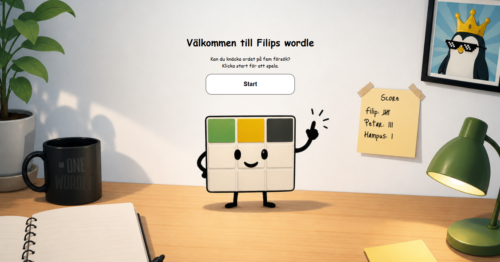
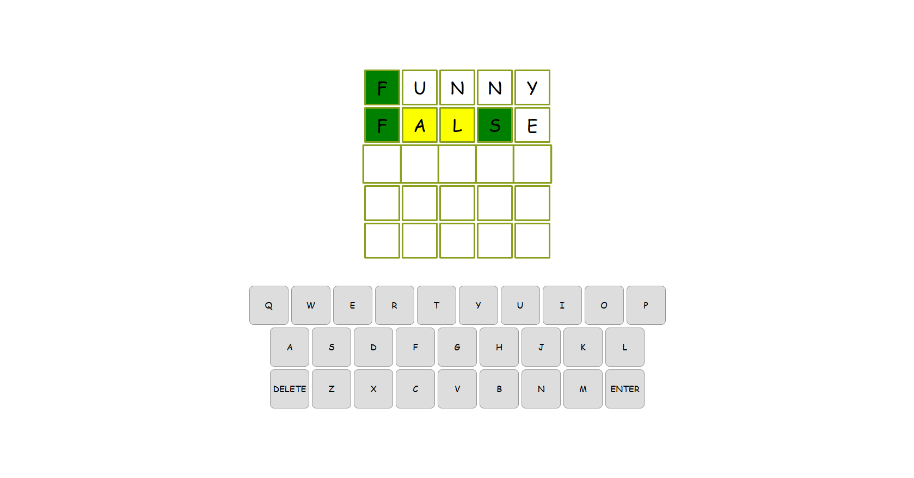
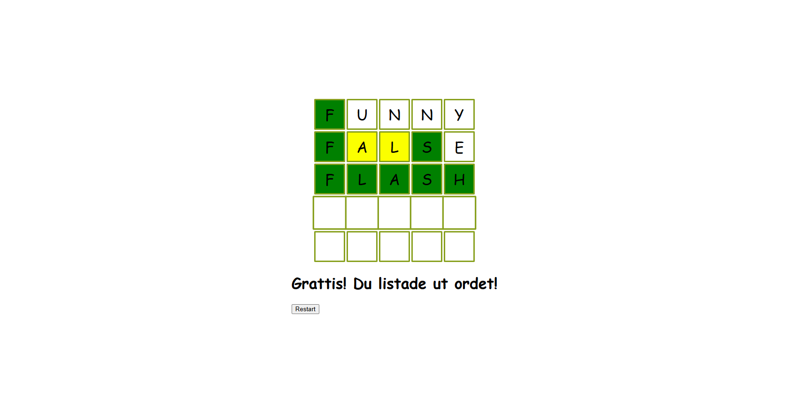

# Wordle

A Wordle clone built with React and TypeScript.





## Getting Started

```bash
git clone https://github.com/Liljenberg89/wordle.git
cd wordle-react
npm install
npm run dev
```

Open [http://localhost:5173](http://localhost:5173) in your browser.

## Tech Stack

- React
- TypeScript
- Vite
